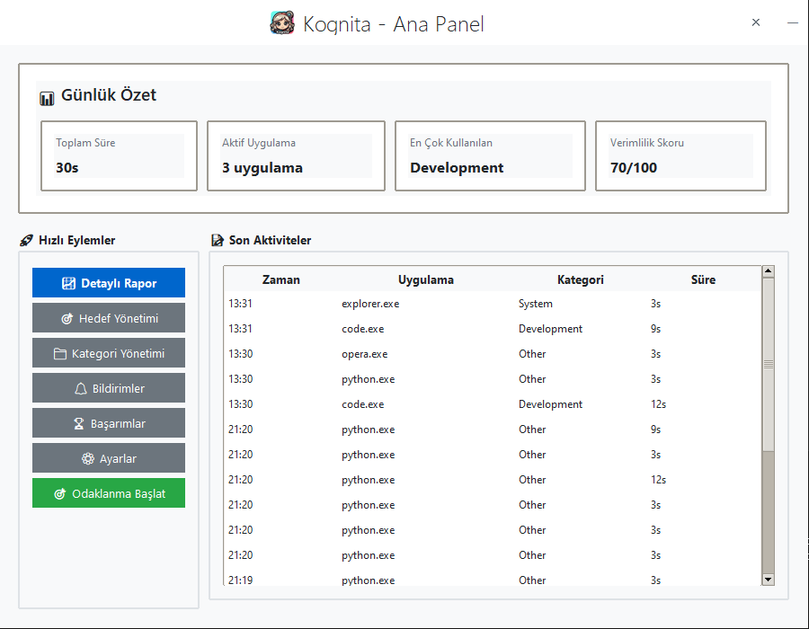
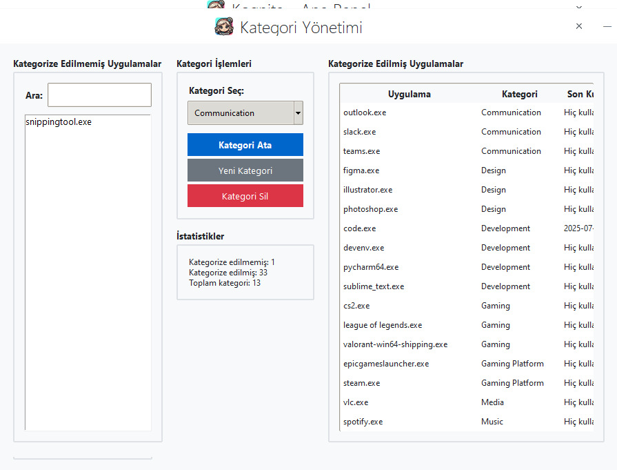
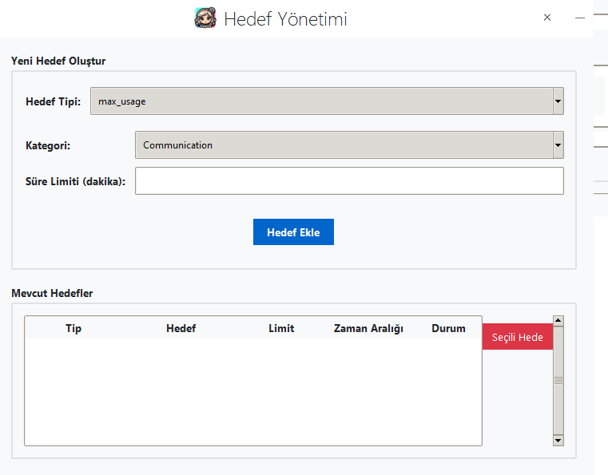

# Kognita

*The Art of Understanding Your Digital Footprint.*

[](https://opensource.org/licenses/MIT)
[](https://www.microsoft.com/windows/)
[](https://www.python.org/)

Kognita is a silent, local-first desktop activity tracker that helps you understand how you spend time on your computer. It runs from the system tray, keeps your data on your machine, and gives you clear insights without feeling like surveillance.

## Features
- Silent background tracking with no terminal window required.
- Smart idle detection so only active time is logged.
- Privacy-first storage in SQLite with a machine-specific AES-256 key when crypto dependencies are available.
- Modern dashboard with reports, charts, and CSV/PDF export.
- Goal management with limits, targets, and app blocking.
- Focus mode with allowed categories and distraction reminders.
- Achievements and digital persona insights to keep things fun.
- English and Turkish interface support.
- System tray integration for quick access to every screen.

## Getting Started

### For End-Users (recommended)
1. Go to the project's [Releases](https://github.com/Rtur2003/Kognita/releases) page.
2. Download `Kognita.exe` from the latest release assets.
3. Run the executable. No Python setup is required.

### For Developers
1. Prerequisites: Python 3.10+ and Git.
2. Clone and set up the environment:
   ```bash
   git clone https://github.com/Rtur2003/Kognita.git
   cd Kognita
   python -m venv venv
   .env\Scriptsctivate
   pip install -r requirements.txt
   ```

## Usage
- Run `Kognita.exe` (users) or `python main.py` (developers).
- The Kognita icon appears in the Windows system tray and starts tracking automatically.
- Right-click the tray icon to open:
  - Show Dashboard
  - Start Focus Session
  - Reports
  - Manage Goals
  - Manage Categories
  - Achievements
  - Settings
  - Exit

## Privacy & Telemetry
- All data stays local in `kognita_data.db`; when crypto dependencies exist, payloads are also stored with a machine-derived AES-256 key.
- Sentry error reporting is **off by default**. To enable it, set `settings.enable_sentry_reporting` to `true` in `config.json` and provide `SENTRY_DSN` (and optional `SENTRY_TRACES_SAMPLE_RATE` / `SENTRY_PROFILES_SAMPLE_RATE`).
- Logs are written to `%APPDATA%\Kognita\logs\kognita.log` with rotation plus stdout so you can debug issues without leaving a terminal open.
- Set `KOGNITA_LOG_LEVEL=DEBUG` for verbose troubleshooting output.

## UI Showcase

<table>
  <tr>
    <td></td>
    <td></td>
  </tr>
  <tr>
    <td align="center"><em>Main Dashboard</em></td>
    <td align="center"><em>Reports and Charts</em></td>
  </tr>
  <tr>
    <td></td>
    <td></td>
  </tr>
  <tr>
    <td align="center"><em>Goal Management</em></td>
    <td align="center"><em>Onboarding</em></td>
  </tr>
</table>

## Built With
- Python 3
- Tkinter
- Pystray
- Psutil & Pywin32
- Pynput
- Pillow
- Matplotlib
- ReportLab
- PyCryptodomex
- Plyer
- WMI
- Sentry-SDK

## Contributing
- Report bugs or request features via issues.
- Fork the repo, create a branch, commit, push, and open a pull request when ready.

## License
This project is licensed under the MIT License. See `LICENSE` for details.
